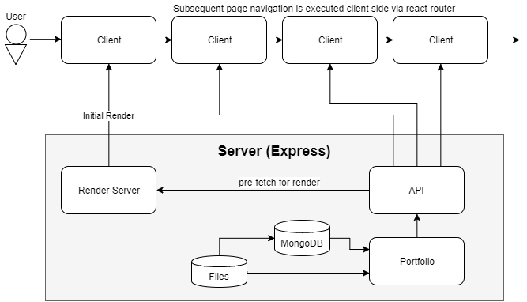

People often say that we should have an online presence. I began my own with a static webpage, but over time I've felt the need for a portfolio befitting a programmer. A portfolio where the portfolio is part of the portfolio. Despite plenty of existing solutions, I created my own.

I began by analyzing what was important.
- Support for multiple hobbies (programming, video editing, etc)
- Searchable and cached on Google ("SEO friendly")
- Human friendly but permanent page urls and links
- To show off my own programming ability as a piece of my portfolio

These goals don't require a fully dynamic CMS, but they do necessitate certain techniques such as server side rendering. I don't intend on making the application scale for the initial version, but I may do so in a later version.

The code behind the portfolio is available on Github at 
https://github.com/CarlosFdez/personalwebsite

## My Tools

After some deliberation, I settled on the following.
- Typescript
- React
- Redux
- React Router and React Router Redux
- Webpack
- NodeJS
- Express

I originally planned on a Python server with Flask, pjax, and jquery, which I had more experience with. However, client side had many interesting evolutions in the past few years. Avoiding the unknown for the sake of comfort is how you get left behind in the software development world.

React is a declarative approach to templating, and using a node backend allows us to *server side render* without needing another process. Server side rendering is required because we want google to cache it. Going this route will make it easier to add more dynamic front end behavior in future installments. 

## Architecture and Design

Most of the actual architecture is available in the source code, but the application consists of three core parts: The render server, the API, and the client. I'll describe what each of the components do, and finish with a chart describing it all.

The render server reads data from the API and renders the initial load of the client. Afterwards, all subsequent page navigation is rendered client side using data fetched from the API. Reusing the API in both the client and server makes it easier to guarantee that both the server and client will render correctly.

The API receives its data from the portfolio system, which is a directory of files indexed using MongoDb. Storing the portfolio data in the file system allows me to use a private github repository for backup and deployment. While this arrangement scales poorly, scaling is not one of my goals.

This is a rough overview of the project structure and flow:

